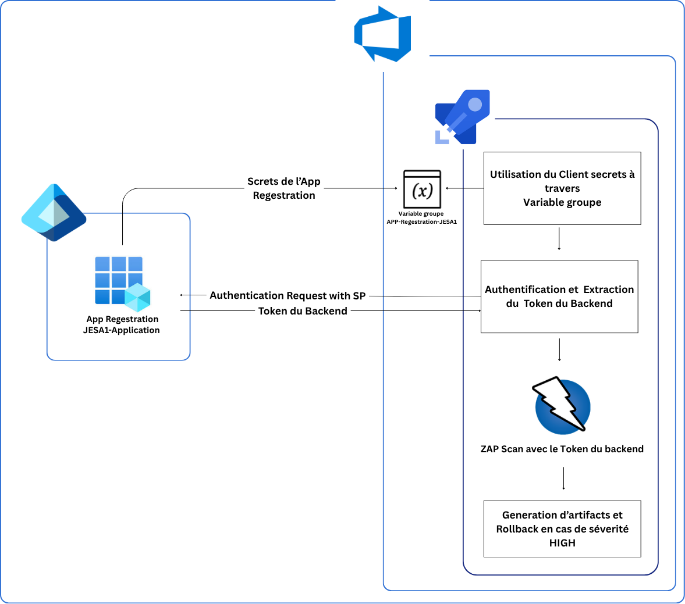
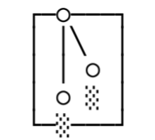

#  Security Scanning Architecture (DAST & SAST)

This document explains the **security testing architecture** implemented in the CI/CD pipeline, covering both **DAST (Dynamic Application Security Testing)** and **SAST (Static Application Security Testing)**.

---

#  DAST – Dynamic Application Security Testing

##  Architecture Overview

The DAST architecture is based on authenticated scanning using Azure AD and OWASP ZAP.

###  Flow Description

1. **Azure Entra ID (Client Secrets)**

   * Stored securely in CI/CD Variable Groups

2. **Token Generation (Runtime)**

   * A Bash script uses client credentials
   * Generates a **Bearer Access Token**

3. **Authenticated Scan (OWASP ZAP)**

   * Token is injected into scan headers
   * Ensures access to protected endpoints

4. **Security Testing Execution**

   * OWASP ZAP scans the running backend
   * Detects vulnerabilities in real conditions

---

##  Architecture Diagram

---

##  Endpoint Discovery Strategy

###  Challenge

* Docker version of OWASP ZAP does not always discover all API endpoints.

###  Solutions

#### 1. Swagger-based Discovery

* If available, `/swagger.json` is used
* Automatically imports API endpoints into ZAP

#### 2. Automation Framework

* ZAP automation framework uses Swagger definitions

#### 3. Manual Endpoint Definition (Fallback)

If Swagger is not available:

* `/api/dashboard`
* `/api/health`
* Other critical endpoints are manually defined

---

## 📌 DAST Benefits

* Fully authenticated scanning
* Real-world attack simulation
* CI/CD integrated security validation
* Improved API endpoints discovery via Swagger

---

#  SAST – Static Application Security Testing

##  Architecture Overview

The SAST pipeline is built using two main open-source tools:

###  1. Opengrep

* Detects security vulnerabilities in source code
* Identifies insecure patterns and risky code usage

###  2. Gitleaks

* Detects secrets in the repository
* Examples:

  * API keys
  * Tokens
  * Passwords

---

logos de OpenGrep et GitLeaks

---

##  CI/CD Integration Flow

1. Code is pulled in CI/CD pipeline
2. SAST tools are executed:

   * Opengrep → vulnerability detection
   * Gitleaks → secret detection
3. Reports are generated in **SARIF format**
4. Reports are converted to JSON for further processing and generating an HTML Report

5. Report are being pushed into artifacts of the pipeline

---

---
